# 📄 TÀI LIỆU YÊU CẦU SẢN PHẨM (PRD)
## HỆ THỐNG QUẢN LÝ XUẤT KHO & PHÂN PHỐI THẺ VETC (VCDMS)

> **Đối tượng đọc**: Đội phát triển — Architect, Engineer, QA, Designer. Tài liệu này đủ chi tiết để thiết kế mô hình dữ liệu và viết test case.
> **Nguồn sự thật**: [SRS-VETC](./SRS-VETC.md). Bối cảnh nghiệp vụ: [BRD-001](./BRD/BRD-001-He-Thong-Xuat-Kho-Phan-Phoi-The-VETC.md). Các điểm chờ khách hàng chốt: [Analysis-Open-Questions-VETC](../050-Research/Analysis-Open-Questions-VETC.md).

### Quy ước nhãn dùng xuyên tài liệu

| Nhãn | Ý nghĩa |
| :--- | :--- |
| **[SRS]** | Có căn cứ trực tiếp/nguyên văn trong SRS-VETC. Được phép triển khai. |
| **[SUY LUẬN]** | BA suy ra, có nêu căn cứ. Cần xác nhận trước khi chốt thiết kế. |
| **[TBD]** | Chưa có dữ liệu. Chờ khách hàng trả lời mã `Q-NN`. **Không được tự bịa nội dung.** |

> ⚠️ **Chuẩn hóa thuật ngữ (mã C-18)**: SRS gọi cùng một khái niệm bằng 4 tên khác nhau. Tài liệu này thống nhất dùng **"Đơn xuất thẻ"**.
>
> ⚠️ **Quy tắc về số liệu**: Trong toàn bộ tài liệu này, **chỉ có 2 con số đến từ SRS** là **tra cứu ≤ 2 giây** và **sao lưu hàng ngày**. Mọi con số khác đều nằm trong mục [9. Giả định thiết kế](#9-giả-định-thiết-kế-design-assumptions) và mang nhãn **"giả định thiết kế chờ xác nhận"** — **không phải cam kết**.

---

## 📑 Mục lục

1. [Executive Summary](#1-executive-summary)
2. [Background & Objectives](#2-background--objectives)
3. [Target Audience](#3-target-audience)
4. [Functional Requirements](#4-functional-requirements)
5. [Non-Functional Requirements](#5-non-functional-requirements)
6. [State machine trạng thái Đơn xuất thẻ](#6-state-machine-trạng-thái-đơn-xuất-thẻ)
7. [User Flows & UX Requirements](#7-user-flows--ux-requirements)
8. [Success Metrics](#8-success-metrics)
9. [Giả định thiết kế (Design Assumptions)](#9-giả-định-thiết-kế-design-assumptions)
10. [Mâu thuẫn đã phát hiện trong SRS](#10-mâu-thuẫn-đã-phát-hiện-trong-srs)
11. [Tài liệu liên quan](#11-tài-liệu-liên-quan)

---

## 1. Executive Summary

**VCDMS** là hệ thống quản lý việc xuất thẻ VETC từ kho tới mạng lưới Sale/Đại lý, xây dựng quanh **luồng phê duyệt 2 cấp bắt buộc** và **khả năng truy vết trọn vòng đời thẻ**.

Phạm vi sản phẩm gồm **25 yêu cầu chức năng (FR-01…FR-25)** và **7 yêu cầu phi chức năng (NFR-01…NFR-07)**, tất cả đều rút trực tiếp từ SRS-VETC.

**Ba điểm mà đội phát triển cần nắm trước khi bắt tay vào thiết kế:**

1. **State machine hiện chỉ phủ luồng thuận.** SRS định nghĩa đúng 5 trạng thái và 5 phép chuyển trạng thái — tất cả đều là happy path. **8 nhánh nghiệp vụ (T-a…T-h) chưa được định nghĩa**, trong đó có những nhánh xảy ra hàng ngày như *từ chối đơn*, *giao hàng thất bại*, *nhận thiếu hàng*. Đây là **rủi ro thiết kế lớn nhất** của dự án: chốt muộn thì phải thay đổi mô hình dữ liệu sau khi đã có dữ liệu thật.

2. **Có một khối phụ thuộc gốc gồm 4 vấn đề liên đới.** `Q-01` (có luồng nhập kho không?) → `Q-26` (tồn kho lấy từ đâu?) → `Q-06` (ai gán dải Series?) → `NFR-05` (chặn Series trùng bằng cách nào?). Bốn vấn đề này là **một khối**: khách hàng trả lời `Q-01` khác đi thì cả bốn phải thiết kế lại. **Không nên bắt đầu thiết kế mô hình dữ liệu tồn kho trước khi `Q-01` được chốt.**

3. **31 giả định thiết kế đang được áp dụng tạm.** Toàn bộ nằm ở [mục 9](#9-giả-định-thiết-kế-design-assumptions), mỗi giả định gắn mã `Q-NN` và ghi rõ hệ quả nếu khách hàng trả lời khác. Đây là bản đồ để biết **phải sửa chỗ nào** khi có câu trả lời.

---

## 2. Background & Objectives

### 2.1. Problem Statement

Việc phân phối thẻ VETC từ kho tới Sale/Đại lý hiện chưa có hệ thống quản lý thống nhất, dẫn tới bốn nhóm vấn đề: **thất thoát thẻ**, **thiếu khả năng truy vết**, **quy trình phê duyệt lỏng lẻo / đơn trùng lặp**, và **thiếu bằng chứng giao nhận**. **[SUY LUẬN]** — phân tích đầy đủ tại [BRD-001, mục 2](./BRD/BRD-001-He-Thong-Xuat-Kho-Phan-Phoi-The-VETC.md).

Hiện trạng vận hành (as-is): `TBD` — **Q-30**.

### 2.2. Goals

| # | Mục tiêu sản phẩm | Yêu cầu chức năng liên quan | Nhãn |
| :--- | :--- | :--- | :--- |
| **G-01** | Ghi nhận và xử lý mọi trường hợp thất thoát thẻ qua cơ chế đền bù có chứng từ. | FR-15, FR-16, FR-17 | **[SUY LUẬN]** |
| **G-02** | Truy vết được nguồn gốc bất kỳ mã thẻ nào: kho xuất, người xuất, người nhận, mốc thời gian. | FR-14, FR-20, FR-21 | **[SUY LUẬN]** |
| **G-03** | Thực thi luồng phê duyệt 2 cấp có dấu vết đầy đủ. | FR-04, FR-06, FR-07, NFR-04 | **[SUY LUẬN]** |
| **G-04** | Chuẩn hóa bằng chứng giao nhận và tự động sinh chứng từ bàn giao. | FR-11, FR-12, FR-13 | **[SUY LUẬN]** |
| **G-05** | Tra cứu thông tin thẻ trong ≤ 2 giây. | FR-20, NFR-06 | **[SRS]** *(chỉ tiêu 2 giây là số liệu SRS)* |

> ⚠️ **Mục tiêu định lượng (SMART) chưa có.** SRS không chứa KPI nào. Chờ **Q-29**. Xem [mục 8](#8-success-metrics).

### 2.3. Non-Goals

> ⚠️ **Căn cứ**: SRS **không có mục Non-Goals**. Danh sách dưới đây là **[SUY LUẬN]** dựa trên giả định tạm đang áp dụng, **chưa được khách hàng xác nhận**. Nếu khách hàng trả lời khác ở các mã `Q-NN` tương ứng, hạng mục sẽ chuyển ngược vào phạm vi.

| # | Không nằm trong phạm vi | Giả định dựa trên | Nếu khách hàng trả lời khác |
| :--- | :--- | :---: | :--- |
| **NG-01** | **Luồng nhập kho** (nhận thẻ từ nhà cung cấp về kho): tạo phiếu nhập, duyệt phiếu nhập, đối soát với nhà cung cấp. Giai đoạn 1 chỉ khởi tạo tồn kho bằng import Excel một lần. | **Q-01** | Phải thiết kế thêm thực thể phiếu nhập, luồng duyệt riêng, và mô hình pool Series đầy đủ. Kéo theo Q-06, Q-26. **Đây là thay đổi phạm vi lớn nhất có thể xảy ra.** |
| **NG-02** | **Tích hợp cổng thanh toán / ví điện tử** cho khoản đền bù thẻ mất. Chỉ ghi nhận thủ công (số tiền, mã giao dịch, ảnh chứng từ). | **Q-04** | Phát sinh hợp đồng cổng thanh toán, xử lý callback, đối soát giao dịch, luồng hoàn tiền và yêu cầu tuân thủ PCI. Khối lượng công có thể gấp 5–10 lần. |
| **NG-03** | **Ứng dụng native trên iOS/Android.** Chỉ làm web application responsive, tối ưu riêng cho luồng nhận hàng trên màn hình điện thoại. | **Q-23** | Phát sinh toàn bộ nhánh phát triển mobile, quy trình phát hành qua store, và cơ chế cập nhật phiên bản. |
| **NG-04** | **Theo dõi thẻ sau khi Đại lý bàn giao cho khách hàng cuối.** Vòng đời thẻ dừng ở mốc "Đã bàn giao cho Đại lý". | **Q-16** | Phải mở rộng vòng đời thẻ và có thể phải tích hợp với hệ thống kích hoạt thẻ của nhà cung cấp. |
| **NG-05** | **SSO (đăng nhập bằng tài khoản công ty) và xác thực 2 lớp.** Dùng tài khoản riêng của hệ thống. | **Q-14** | Phải triển khai OAuth 2.0/OIDC và tích hợp với hệ thống định danh sẵn có của khách hàng. |
| **NG-06** | **Quản lý công nợ / hạn mức tín dụng của Đại lý.** | — | SRS không nhắc tới ở bất kỳ đâu. |

---

## 3. Target Audience

Ba persona dưới đây được **[SUY LUẬN]** từ bảng phân quyền RBAC của SRS (d.37–43).

### P1 — Admin (Quản trị viên)

| Thuộc tính | Nội dung |
| :--- | :--- |
| **Trách nhiệm [SRS]** | Phê duyệt cuối cùng Đơn xuất thẻ; quản lý danh mục (kho, nhân sự); giám sát toàn bộ luồng dữ liệu; xem báo cáo tổng hợp. *(d.41)* |
| **Đặc điểm hành vi [SUY LUẬN]** | Người ra quyết định cuối. Cần cái nhìn toàn cảnh, làm việc chủ yếu trên các màn hình danh sách và báo cáo. Ưu tiên **duyệt nhanh hàng loạt** và **giám sát**. |
| **Hàm ý thiết kế** | Màn hình danh sách chờ duyệt phải hỗ trợ lọc và xem nhanh thông tin quyết định (số lượng yêu cầu vs số lượng duyệt, lý do điều chỉnh, kho xuất). Cần dashboard tổng hợp. |
| **Nền tảng chính** | Desktop. |
| **Chưa rõ** | Số lượng Admin trong hệ thống? Có phân cấp Admin không? → `TBD` **Q-07**, **Q-12** |

### P2 — Nhân viên Kho

| Thuộc tính | Nội dung |
| :--- | :--- |
| **Trách nhiệm [SRS]** | Tiếp nhận yêu cầu; kiểm tra tồn kho; điều chỉnh số lượng xuất; chọn kho xuất hàng; quản lý thất thoát; cập nhật danh mục kho. *(d.42)* |
| **Đặc điểm hành vi [SUY LUẬN]** | Vận hành trực tiếp tại kho với hàng vật lý. Thao tác **nhiều lần trong ngày**, cần đối chiếu tồn kho ↔ Đơn xuất thẻ thật nhanh. Là người **cấp dải Series** *(căn cứ: d.130 "do kho cấp")*. |
| **Hàm ý thiết kế** | Màn hình soát xét đơn phải hiển thị đồng thời: số lượng yêu cầu, tồn kho khả dụng, dải Series gợi ý, ô ghi lý do điều chỉnh. Tối ưu cho thao tác lặp lại. |
| **Nền tảng chính** | Desktop (tại kho). |
| **Chưa rõ** | Có bị giới hạn xử lý theo kho được phân công không? → `TBD` **Q-12**. Có phân cấp Nhân viên Kho thường / Trưởng kho không? → `TBD` **Q-18** |

### P3 — Sale / Đại lý

| Thuộc tính | Nội dung |
| :--- | :--- |
| **Trách nhiệm [SRS]** | Tạo Đơn xuất thẻ; theo dõi trạng thái đơn; xác nhận nhận hàng kèm hình ảnh chứng minh; tra cứu thẻ. *(d.43)* |
| **Đặc điểm hành vi [SUY LUẬN]** | Người dùng **ở hiện trường**. Nghiệm thu diễn ra **tại nơi nhận hàng**, thao tác chụp ảnh mang đặc trưng mobile rất mạnh *(căn cứ: d.108–111)*. |
| **Hàm ý thiết kế** | **Luồng Bước 5 (nhận hàng) bắt buộc phải dùng được tốt trên điện thoại**, gồm: chụp ảnh trực tiếp từ camera, đối soát dải Series trên màn hình nhỏ, xác nhận một chạm. Nếu bỏ qua yêu cầu này thì FR-11 (mức P0) thực tế không dùng được. |
| **Nền tảng chính** | Mobile web (Bước 5) + Desktop (tạo đơn, theo dõi). |
| **⚠️ Rủi ro persona** | SRS **gộp Sale (nội bộ) và Đại lý (đối tác ngoài) làm một vai trò**. Đây là hai persona khác nhau căn bản về mức tin cậy, phạm vi dữ liệu được xem, và trách nhiệm đền bù. → `TBD` **Q-21**, **Q-12** |
| **Chưa rõ** | Nền tảng chính thức (web responsive hay native app)? → `TBD` **Q-23** |

---

## 4. Functional Requirements

> **25 yêu cầu chức năng**, tất cả đều rút trực tiếp từ SRS-VETC. Cột *Nguồn SRS* ghi mục và số dòng để truy vết ngược.
> **Quy ước ưu tiên**: `P0` = bắt buộc cho bản chạy được đầu tiên · `P1` = cần thiết nhưng không chặn luồng chính · `P2` = có thể lùi giai đoạn sau.

| ID | Tính năng | Mô tả | Nguồn SRS | Ưu tiên |
| :--- | :--- | :--- | :--- | :---: |
| **FR-01** | Tạo Đơn xuất thẻ | Sale/Đại lý lập đơn: chọn loại thẻ, số lượng. Điểm khởi phát toàn bộ workflow. | II Bước 1 (d.87–89); III.1 (d.119) | **P0** |
| **FR-02** | Kiểm tra tồn kho khi soát xét | NV Kho xem tồn kho để quyết định duyệt hoặc điều chỉnh số lượng. ⚠️ Nguồn dữ liệu tồn kho chưa được SRS định nghĩa → **Q-26**, **Q-01**. | I (d.42); II Bước 2 (d.92) | **P0** |
| **FR-03** | Cảnh báo / từ chối nhanh đơn trùng lặp | Cảnh báo hoặc cho NV Kho từ chối nhanh các đơn trùng gửi trong thời gian ngắn. ⚠️ Định nghĩa "trùng lặp" và cửa sổ thời gian chưa chốt → **Q-05**, **Q-17**. | III.1 (d.120); II (d.93) | **P1** |
| **FR-04** | Điều chỉnh Số lượng duyệt kèm lý do bắt buộc | NV Kho sửa *Số lượng duyệt* khác *Số lượng yêu cầu*, **bắt buộc** nhập lý do ghi chú. Thực thi BR-02, gắn trực tiếp với Audit Log. | III.1 (d.121); II (d.94) | **P0** |
| **FR-05** | Gán kho xuất hàng | NV Kho chọn kho xuất từ Danh mục kho. Không có kho nguồn thì FR-14 không truy vết được. | II Bước 2 (d.95) | **P0** |
| **FR-06** | Phê duyệt cấp 1 (Kho) | NV Kho duyệt, chuyển đơn sang chờ Admin. Mắt xích 1 của BR-01. | II Bước 2 (d.96–97) | **P0** |
| **FR-07** | Phê duyệt cấp 2 (Admin) | Admin ra quyết định phê duyệt cuối cùng. Mắt xích 2 của BR-01. ⚠️ Nhánh Admin từ chối chưa được định nghĩa → **Q-10**. | II Bước 3 (d.99–101) | **P0** |
| **FR-08** | Đẩy đơn sang đơn vị vận chuyển qua API | Hệ thống tự động chuyển đơn đã duyệt sang carrier. Phụ thuộc bên thứ ba; giai đoạn 1 có thể nhập tay mã vận đơn → **Q-02**. | II Bước 4 (d.104); III.2 (d.125) | **P1** |
| **FR-09** | Đồng bộ tracking real-time | Cập nhật vị trí/trạng thái theo thời gian thực từ carrier. ⚠️ "Real-time" chưa được định lượng → **Q-03**. | II Bước 4 (d.105); III.2 (d.125) | **P1** |
| **FR-10** | Hiển thị thông tin vận chuyển | Hiển thị trạng thái đơn hàng, vị trí hiện tại, mã vận đơn, tên đơn vị giao hàng. Phụ thuộc FR-09. | III.2 (d.126) | **P1** |
| **FR-11** | Upload ảnh POD (tối thiểu 01 ảnh) | Bắt buộc Sale/Đại lý đính kèm ≥ 1 ảnh chụp lô thẻ thực tế khi nhận hàng. Thực thi BR-03. ⚠️ Giới hạn số lượng/dung lượng ảnh chưa có → **Q-13**. | III.3 (d.129); II (d.109) | **P0** |
| **FR-12** | Check-list đối soát dải Series | Hiển thị *Series bắt đầu – Series kết thúc* do kho cấp để Sale đối soát khi nhận hàng. Thực thi BR-04, là điều kiện đóng đơn. | III.3 (d.130); II (d.110) | **P0** |
| **FR-13** | Xuất Biên bản Bàn giao Thẻ tự động | Sinh file PDF/Excel ngay khi bấm [Hoàn thành]. ⚠️ Mẫu biểu và định dạng chưa chốt → **Q-19**. | III.3 (d.131); II (d.82) | **P1** |
| **FR-14** | Truy xuất nguồn gốc thẻ (Traceability) | Tra một mã thẻ ra: kho xuất, NV kho phụ trách, Sale/Đại lý tiếp nhận, ngày giờ xuất kho, ngày giờ nhận hàng thực tế. Mục tiêu nghiệp vụ cốt lõi. | III.4 (d.134–138) | **P0** |
| **FR-15** | Ghi nhận thẻ báo mất / hỏng | Đánh dấu thẻ mất hoặc hỏng trong hệ thống. | III.4 (d.140) | **P1** |
| **FR-16** | Ghi nhận đền bù thẻ mất | Nhập số tiền, mã giao dịch, đính kèm hóa đơn đền bù. Phụ thuộc FR-15. ⚠️ Cơ chế (thanh toán online vs ghi nhận thủ công) chưa chốt → **Q-04**, **Q-22**. | III.4 (d.141) | **P2** |
| **FR-17** | Tự động cập nhật trạng thái `Báo mất - Đã đền bù` | Chuyển trạng thái thẻ sau khi ghi nhận xong đền bù. Thực thi BR-08, là hệ quả của FR-16. | III.4 (d.142) | **P2** |
| **FR-18** | CRUD Danh mục kho | Tạo mới, chỉnh sửa, xóa hoặc **ẩn** danh mục kho. Master data mà FR-05 phụ thuộc. | III.5 (d.145) | **P0** |
| **FR-19** | Quản lý thông tin chi tiết kho | Lưu: Tên kho, Địa chỉ, Tên nhân viên kho phụ trách gửi hàng, Số điện thoại liên hệ. | III.5 (d.146) | **P0** |
| **FR-20** | Global Search | Tra cứu nhanh theo Mã thẻ / Dải Series thẻ và Tên nhân viên (Sale, Kho, Admin). Chịu ràng buộc NFR-06 (≤ 2 giây). | III.6 (d.150) | **P1** |
| **FR-21** | Bộ lọc nâng cao đa điều kiện | Lọc theo khoảng thời gian (ngày xuất / ngày nhận), trạng thái đơn hàng, kho xuất hàng, đại lý tiếp nhận. | III.6 (d.151–155) | **P1** |
| **FR-22** | Theo dõi trạng thái đơn (phía Sale) | Sale/Đại lý theo dõi trạng thái các đơn của mình. Không thấy đơn thì không biết khi nào nhận hàng. | I (d.43) | **P0** |
| **FR-23** | Tra cứu thẻ (phía Sale) | Sale/Đại lý tra cứu thẻ. Khác FR-14 ở **phạm vi dữ liệu được xem** → **Q-12**. | I (d.43) | **P1** |
| **FR-24** | Quản lý danh mục nhân sự | `TBD` — **Q-28**. ⚠️ Chức năng này chỉ tồn tại trong **một ô của bảng RBAC** (d.41), mục III của SRS **không có bất kỳ đặc tả nào**. **Không được tự bịa nội dung.** | I (d.41) | **P1** |
| **FR-25** | Báo cáo tổng hợp & giám sát luồng dữ liệu | `TBD` — **Q-28**. ⚠️ Chức năng này chỉ tồn tại trong **một ô của bảng RBAC** (d.41), mục III của SRS **không có bất kỳ đặc tả nào**. "Báo cáo tổng hợp" là cụm từ có thể nở ra vô hạn → nguồn scope creep điển hình. **Không được tự bịa danh sách báo cáo.** | I (d.41) | **P2** |

> 🔴 **Cảnh báo dành cho Architect và QA về FR-24 và FR-25**: hai yêu cầu này **không có đặc tả**. Không được thiết kế màn hình, không được viết test case, và **không được ước lượng công** cho tới khi **Q-28** có câu trả lời. Giả định tạm mà đội đang áp dụng (4 báo cáo cụ thể) nằm ở [mục 9](#9-giả-định-thiết-kế-design-assumptions) và **chỉ là giả định**.

---

## 5. Non-Functional Requirements

### 5.1. Yêu cầu phi chức năng đã được SRS định nghĩa

> ⚠️ **Số liệu trong bảng này giữ nguyên đúng như SRS.** Chỉ có 2 con số: **≤ 2 giây** và **hàng ngày**.

| ID | Hạng mục | Mô tả (giữ nguyên số liệu SRS) | Nguồn SRS | Ưu tiên |
| :--- | :--- | :--- | :--- | :---: |
| **NFR-01** | Xác thực (Authentication) | **JWT (JSON Web Token) hoặc OAuth 2.0**. ⚠️ Chữ "hoặc" nghĩa là **chưa chốt** — đây là lựa chọn, không phải yêu cầu → **Q-14**. | IV.1 (d.162) | **P0** |
| **NFR-02** | Phân quyền (Authorization) | Phân quyền **chặt chẽ theo vai trò (RBAC)** cho 3 nhóm người dùng. ⚠️ SRS chỉ định nghĩa quyền **theo chức năng**, **không** định nghĩa quyền **theo phạm vi dữ liệu** → **Q-12**. | IV.1 (d.162); I (d.37) | **P0** |
| **NFR-03** | Mã hóa & truyền tải | Mã hóa **toàn bộ dữ liệu nhạy cảm**; bắt buộc truyền tải qua **HTTPS (SSL/TLS)**. | IV.1 (d.163) | **P0** |
| **NFR-04** | Audit Log | Ghi nhận **toàn bộ** lịch sử tác động dữ liệu: ai tạo, ai sửa số lượng, ai duyệt, **timestamp** cụ thể. Phục vụ tra soát và kiểm toán. Là cơ chế thực thi BR-01/BR-02. | IV.1 (d.164) | **P0** |
| **NFR-05** | Error Handling / Validation | **Chặn nhập số lượng âm**; **chặn chọn dải Series bị trùng lặp**. ⚠️ Muốn chặn trùng Series thì hệ thống phải quản lý được toàn bộ danh sách Series đang tồn — điều mà SRS chưa cung cấp nền tảng → **Q-01**, **Q-06**, **Q-16**. | IV.2 (d.167) | **P0** |
| **NFR-06** | Response Time | Thời gian phản hồi cho thao tác **tra cứu / tìm kiếm mã thẻ ≤ 2 giây**. ⚠️ Chỉ áp dụng cho tra cứu/tìm kiếm, **không** áp cho toàn hệ thống. Không nghiệm thu được nếu chưa biết quy mô dữ liệu → **Q-07**. | IV.2 (d.168) | **P1** |
| **NFR-07** | Backup & Recovery | **Tự động sao lưu dữ liệu hàng ngày (Daily Backup)**. ⚠️ SRS nêu **tần suất**, **không** nêu retention, số bản giữ lại, RPO/RTO → **Q-08**. | IV.2 (d.169) | **P1** |

### 5.2. Yêu cầu phi chức năng chưa xác định

> 🔴 **SRS hoàn toàn im lặng về 13 hạng mục dưới đây.** Đây **không phải** là các hạng mục "không cần" — đây là các hạng mục **chưa ai hỏi tới**. Đội phát triển **không được tự điền số liệu** cho bất kỳ dòng nào.

| # | Hạng mục NFR còn thiếu | Vì sao cần | Chờ trả lời |
| :--- | :--- | :--- | :--- |
| 1 | **Availability / Uptime SLA** | Không có cam kết thời gian hoạt động thì không chọn được kiến trúc dự phòng. | **Q-07** |
| 2 | **Concurrent users** | Không biết số người dùng đồng thời thì không cấu hình được máy chủ. | **Q-07** |
| 3 | **Throughput** (số đơn xử lý/đơn vị thời gian) | Ảnh hưởng thiết kế hàng đợi xử lý và giới hạn gọi API vận chuyển. | **Q-07** |
| 4 | **Data retention** (dữ liệu đơn hàng & ảnh POD) | Giữ 3 tháng hay 7 năm là hai bài toán chi phí lưu trữ chênh nhau hàng chục lần. | **Q-08** |
| 5 | **RPO / RTO** | SRS chỉ nói "sao lưu hàng ngày", chưa nói mất tối đa bao nhiêu dữ liệu và phục hồi trong bao lâu là chấp nhận được. | **Q-08** |
| 6 | **Scalability** | Không biết tốc độ tăng trưởng dữ liệu thì không thiết kế được chiến lược phân mảnh/lưu trữ. | **Q-07** |
| 7 | **Browser / thiết bị hỗ trợ** | Ảnh hưởng trực tiếp tới phạm vi kiểm thử và chi phí frontend. | **Q-23** |
| 8 | **i18n (đa ngôn ngữ)** | Nếu cần hỗ trợ đa ngôn ngữ thì phải thiết kế từ đầu, không thể bổ sung sau rẻ. | — |
| 9 | **Accessibility** | Có thể là yêu cầu bắt buộc tùy chính sách nội bộ của khách hàng. | — |
| 10 | **Disaster Recovery** | Backup ≠ DR. Không có kế hoạch phục hồi thảm họa thì backup có thể vô dụng khi cần. | **Q-08** |
| 11 | **Monitoring / Alerting** | Không có giám sát thì không phát hiện được sự cố tích hợp với đơn vị vận chuyển. | **Q-02** |
| 12 | **Rate limiting** | Cần thiết cả ở phía hệ thống lẫn phía gọi API carrier để tránh vượt giới hạn đối tác. | **Q-02**, **Q-03** |
| 13 | **Nơi lưu trữ dữ liệu** (on-premise / cloud, trong hay ngoài nước) | Ảnh hưởng nghĩa vụ tuân thủ dữ liệu và chi phí hạ tầng. | **Q-13** |

---

## 6. State machine trạng thái Đơn xuất thẻ

> 📌 **[MỤC BỔ SUNG]** — Template PRD chuẩn không có mục này. Mục được thêm vào tài liệu này vì **state machine là rủi ro thiết kế lớn nhất** của dự án. File template dùng chung **không bị chỉnh sửa**.

### 6.1. Trạng thái và phép chuyển trạng thái đã được SRS định nghĩa **[SRS]**

SRS định nghĩa **đúng 5 trạng thái** và **đúng 5 phép chuyển** — toàn bộ đều thuộc luồng thuận.

| # | Trạng thái (mã) | Tiếng Việt | Nguồn SRS |
| :---: | :--- | :--- | :--- |
| S1 | `Pending Warehouse` | Chờ kho duyệt | d.63, d.89 |
| S2 | `Pending Admin Approval` | Chờ Admin duyệt | d.69, d.97 |
| S3 | `Ready for Shipping` | Chờ vận chuyển | d.73, d.101 |
| S4 | `In Transit` | Đang vận chuyển | d.77, d.106 |
| S5 | `Completed` | Hoàn thành | d.81, d.112 |

```mermaid
stateDiagram-v2
    direction LR
    [*] --> PendingWarehouse: Sale/Đại lý tạo Đơn xuất thẻ
    PendingWarehouse --> PendingAdminApproval: NV Kho duyệt<br/>(đã gán kho + chốt SL duyệt)
    PendingAdminApproval --> ReadyForShipping: Admin phê duyệt cuối
    ReadyForShipping --> InTransit: Hệ thống đẩy đơn sang carrier
    InTransit --> Completed: Sale upload POD + đối soát Series<br/>+ bấm [Hoàn thành]
    Completed --> [*]

    PendingWarehouse: S1 · Pending Warehouse<br/>(Chờ kho duyệt)
    PendingAdminApproval: S2 · Pending Admin Approval<br/>(Chờ Admin duyệt)
    ReadyForShipping: S3 · Ready for Shipping<br/>(Chờ vận chuyển)
    InTransit: S4 · In Transit<br/>(Đang vận chuyển)
    Completed: S5 · Completed<br/>(Hoàn thành)
```

> ⚠️ **Sơ đồ trên cố ý chỉ vẽ những gì SRS đã định nghĩa.** Các trạng thái mà đội đề xuất bổ sung (`Rejected`, `Cancelled`, `Discrepancy`, `Delivery Failed`, `Returned`) **không được vẽ vào sơ đồ này** cho tới khi khách hàng chốt — vẽ vào sẽ khiến một quyết định chưa có trở thành thiết kế đã chốt.

### 6.2. ⚠️ Các nhánh chuyển trạng thái CHƯA được định nghĩa

> 🔴 **8 nhánh dưới đây là rủi ro thiết kế lớn nhất của dự án.** Mô hình dữ liệu trạng thái Đơn xuất thẻ **không nên chốt** trước khi các mã `Q-NN` tương ứng có câu trả lời — nếu chốt sớm và sai, việc sửa sẽ phải kèm migration dữ liệu thật.

| # | Sự kiện nghiệp vụ | Vấn đề trong SRS | Trạng thái đề xuất *(chưa chốt)* | Chờ trả lời |
| :--- | :--- | :--- | :--- | :---: |
| **T-a** | **NV Kho từ chối đơn** | Nhánh `alt` trong sơ đồ mermaid (d.65–67) có hành động "Từ chối đơn" nhưng **không có `Note over System` gán trạng thái**, trong khi **mọi nhánh khác đều có**. Nhánh bị **cụt**. | `Rejected` | **Q-09** |
| **T-b** | **Admin từ chối đơn** | Bước 3 (d.99–101) **hoàn toàn không có nhánh từ chối**. Một cấp phê duyệt không có quyền từ chối thì luồng duyệt 2 cấp mất ý nghĩa kiểm soát. | `Rejected` | **Q-10** |
| **T-c** | **Sale sửa & gửi lại đơn bị từ chối** | Không có trạng thái `Draft` / `Rejected` / `Resubmitted`, cũng không có cơ chế liên kết đơn cũ – đơn mới. | Sao chép đơn cũ thành đơn mới (giữ audit trail nguyên vẹn) | **Q-09** |
| **T-d** | **Hủy đơn** | Không có trạng thái `Cancelled` ở bất kỳ giai đoạn nào. Sale gửi nhầm đơn thì không có cách nào ngoài nhờ NV Kho từ chối. | `Cancelled` | **Q-24** |
| **T-e** | **Giao hàng thất bại / hàng hoàn về kho** | Không có `Delivery Failed` / `Returned`. Carrier giao không được → **đơn kẹt vĩnh viễn ở `In Transit`**, và số thẻ vẫn bị tính là đã xuất kho trong khi thực tế đang quay về. | `Delivery Failed` → `Returned` | **Q-25** |
| **T-f** | **Sale nhận thiếu / lệch dải Series** | Bước 5 chỉ mô tả "xác nhận đúng". Không có `Disputed` / `Partially Received`. ⚠️ **Nghịch lý**: SRS xây chức năng quản lý thất thoát nhưng không có luồng nào để **phát hiện** thất thoát. | `Discrepancy` | **Q-11** |
| **T-g** | **Sub-status của carrier ánh xạ vào đâu** | III.2 (d.126) liệt kê 4+ trạng thái carrier ("Đã lấy hàng", "Đang vận chuyển", "Đến bưu cục", "Đang giao...") nhưng mục II chỉ có **một** `In Transit`. Quan hệ giữa hai tập trạng thái **không được định nghĩa**; dấu "..." cho thấy danh sách chưa đóng. | Bảng lịch sử tracking riêng, không đưa vào state machine chính | **Q-15** |
| **T-h** | **Vòng đời trạng thái THẺ** (khác trạng thái ĐƠN) | SRS chỉ nêu **đúng một** trạng thái thẻ: `Báo mất - Đã đền bù` (d.142). Toàn bộ vòng đời còn lại **không tồn tại**. Nhưng FR-14 (truy vết) yêu cầu thẻ phải là một thực thể có vòng đời riêng. | Vòng đời 7 trạng thái *(đề xuất, chưa chốt)* | **Q-16** |

### 6.3. Khuyến nghị triển khai

1. **Thiết kế bảng trạng thái Đơn xuất thẻ theo hướng mở rộng được** (tra cứu từ danh mục trạng thái, không hardcode enum cứng), để khi khách hàng chốt thêm trạng thái thì không phải migration lớn.
2. **Tách bạch hai vòng đời**: vòng đời **Đơn xuất thẻ** (mục 6.1) và vòng đời **Thẻ** (T-h) là hai thực thể khác nhau, không được gộp.
3. **Không đưa trạng thái của carrier vào state machine chính** (T-g) — lưu ở bảng lịch sử hành trình riêng, để đổi đơn vị vận chuyển không làm vỡ quy trình nội bộ.

---

## 7. User Flows & UX Requirements

### 7.1. Luồng chính — Xử lý một Đơn xuất thẻ (5 bước) **[SRS]**

| Bước | Actor | Thao tác | Trạng thái sau bước | FR liên quan | Nền tảng |
| :---: | :--- | :--- | :--- | :--- | :--- |
| **1** | Sale / Đại lý | Lập Đơn xuất thẻ: chọn loại thẻ, nhập số lượng. Hệ thống cảnh báo nếu nghi trùng lặp. | `Pending Warehouse` | FR-01, FR-03 | Desktop / Mobile web |
| **2** | Nhân viên Kho | Kiểm tra tồn kho → **(a)** Từ chối nếu trùng lặp/không hợp lệ; hoặc **(b)** Điều chỉnh số lượng duyệt (bắt buộc ghi lý do), gán kho xuất, gán dải Series, rồi duyệt. | `Pending Admin Approval` | FR-02, FR-03, FR-04, FR-05, FR-06 | Desktop |
| **3** | Admin | Kiểm tra và phê duyệt cuối cùng. | `Ready for Shipping` | FR-07 | Desktop |
| **4** | Hệ thống ↔ Carrier | Đẩy đơn sang đơn vị vận chuyển; đồng bộ trạng thái và vị trí hành trình. | `In Transit` | FR-08, FR-09, FR-10 | — (nền) |
| **5** | Sale / Đại lý | **Tại nơi nhận hàng**: chụp ảnh lô thẻ thực tế, đối soát số lượng và dải Series, bấm [Hoàn thành đơn hàng]. Hệ thống sinh Biên bản Bàn giao. | `Completed` | FR-11, FR-12, FR-13 | **📱 Mobile — bắt buộc** |

### 7.2. 🔴 Yêu cầu UX trọng yếu — Bước 5 diễn ra trên điện thoại tại nơi nhận hàng

Đây là ràng buộc UX **quan trọng nhất** của toàn dự án, và cũng là điểm **SRS hoàn toàn im lặng** *(chờ **Q-23**)*.

**Căn cứ [SUY LUẬN]**: SRS d.109 yêu cầu Sale *"chụp ảnh đối soát thực tế tải lên hệ thống"*. Thao tác này **chỉ có thể** diễn ra tại thời điểm và địa điểm nhận hàng — tức là trên điện thoại, ngoài hiện trường.

| Yêu cầu UX | Chi tiết | Hệ quả nếu bỏ qua |
| :--- | :--- | :--- |
| **Chụp ảnh trực tiếp từ camera** | Không bắt người dùng phải chụp bằng app khác rồi tìm file để tải lên. | Sale sẽ chụp ảnh rồi về văn phòng mới tải lên → **ảnh mất giá trị làm bằng chứng**, mục tiêu G-04 thất bại. |
| **Đối soát dải Series trên màn hình nhỏ** | Hiển thị *Series bắt đầu – Series kết thúc* đủ lớn, dễ đọc dưới ánh sáng ngoài trời; nút xác nhận rõ ràng. | Sale không đối soát được tại chỗ → BR-04 chỉ được thực hiện hình thức. |
| **Hoạt động được ở kết nối mạng yếu** | Nén ảnh trước khi tải lên; hiển thị tiến trình; cho phép thử lại khi lỗi. | Upload thất bại giữa chừng ở kho/bãi giao hàng → đơn không đóng được. |
| **Xác nhận một chạm** | Nút [Hoàn thành đơn hàng] rõ ràng, có bước xác nhận lại để tránh bấm nhầm. | Bấm nhầm "Hoàn thành" khi thực tế nhận thiếu → mất thẻ không ai chịu trách nhiệm *(liên quan **Q-11**)*. |

> ⚠️ **Cảnh báo cho Architect**: FR-11 được xếp mức **P0**, nhưng nếu hệ thống chỉ tối ưu cho màn hình desktop thì FR-11 **thực tế không dùng được**. Đây là rủi ro "làm đúng đặc tả nhưng sai thực tế".

### 7.3. Luồng phụ chưa được định nghĩa

Toàn bộ các luồng dưới đây **chưa có đặc tả UX** vì trạng thái nghiệp vụ tương ứng chưa được chốt (xem [mục 6.2](#62--các-nhánh-chuyển-trạng-thái-chưa-được-định-nghĩa)):

| Luồng phụ | Chờ trả lời |
| :--- | :---: |
| Sale xem đơn bị từ chối và tạo lại đơn mới | **Q-09** |
| Admin từ chối đơn kèm lý do | **Q-10** |
| Sale báo sai lệch khi nhận hàng (thiếu/lệch Series) | **Q-11** |
| Sale/Admin hủy đơn | **Q-24** |
| NV Kho xác nhận nhận lại hàng hoàn | **Q-25** |
| Nhận và xử lý thông báo (in-app / email) | **Q-20** |

---

## 8. Success Metrics

| Chỉ số | Giá trị mục tiêu | Ghi chú |
| :--- | :--- | :--- |
| Định nghĩa "dự án thành công" sau 6 tháng vận hành | `TBD` | **Q-29** |
| Tỷ lệ giảm thất thoát thẻ không truy được nguồn gốc | `TBD` | **Q-29** |
| Thời gian trung bình từ lúc tạo đơn tới lúc nhận hàng | `TBD` | **Q-29**, **Q-30** |
| Thời gian truy vết một mã thẻ | `TBD` | **Q-29** |
| Tỷ lệ đơn có đầy đủ bằng chứng giao nhận (ảnh POD) | `TBD` | **Q-29** |
| Tỷ lệ người dùng thực sự sử dụng hệ thống (adoption rate) | `TBD` | **Q-29**, **Q-30** |

> 🔴 **SRS không chứa bất kỳ KPI, chỉ tiêu định lượng, ngân sách hay ROI nào.** Toàn bộ mục này chờ **Q-29**.
>
> **Chỉ tiêu kỹ thuật duy nhất có số** trong toàn bộ SRS là **NFR-06: tra cứu ≤ 2 giây** — nhưng chỉ tiêu này **chưa nghiệm thu được** vì SRS không cho biết quy mô dữ liệu và số người dùng đồng thời *(chờ **Q-07**)*. Tra cứu trong 10 nghìn bản ghi và trong 10 triệu bản ghi là hai bài toán khác nhau.

---

## 9. Giả định thiết kế (Design Assumptions)

> 📌 **[MỤC BỔ SUNG]** — Template PRD chuẩn không có mục này. File template dùng chung **không bị chỉnh sửa**.
>
> 🔴 **Đọc kỹ trước khi triển khai.** Bảng dưới đây liệt kê **31 giả định** mà đội đang tạm áp dụng để không bị chặn tiến độ. **Đây KHÔNG phải là yêu cầu đã chốt và KHÔNG phải là cam kết.**
>
> Mọi con số xuất hiện trong cột "Giả định đang đi theo" (15 phút, 10 ảnh, 200 người dùng, 500 đơn/ngày, 5 triệu bản ghi, 30 bản backup…) đều là **giả định thiết kế chờ xác nhận**. **Không con số nào trong bảng này đến từ SRS.** Hai số liệu duy nhất có nguồn SRS (≤ 2 giây, sao lưu hàng ngày) nằm ở [mục 5.1](#51-yêu-cầu-phi-chức-năng-đã-được-srs-định-nghĩa).
>
> Cột cuối cùng là **bản đồ tác động**: khi khách hàng trả lời khác, đây là chỗ để biết ngay phải sửa gì.

| Mã | Giả định đang đi theo | Mức độ | Hệ quả nếu khách hàng trả lời khác |
| :--- | :--- | :---: | :--- |
| **Q-01** | Giai đoạn 1 **chỉ làm luồng XUẤT**. Tồn kho khởi tạo bằng import Excel một lần do Admin/NV Kho thực hiện. Luồng nhập kho đầy đủ đưa vào giai đoạn 2. | 🔴 Blocker | **Tác động lớn nhất toàn dự án.** Phải làm lại mô hình dữ liệu tồn kho, cách sinh dải Series và cách hiện thực FR-02 — kèm migration nếu đã có dữ liệu thật. Kéo theo Q-26, Q-06, NFR-05. |
| **Q-02** | Tầng tích hợp theo mô hình **adapter/plugin** (trừu tượng hóa carrier); giai đoạn 1 chạy adapter thủ công (NV Kho nhập tay mã vận đơn và cập nhật trạng thái). | 🔴 Blocker | Nếu carrier chỉ có API tra cứu mà không có API tạo đơn thì **FR-08 bất khả thi như mô tả**. Nếu là carrier khác dự kiến, toàn bộ ước lượng công tích hợp thay đổi. |
| **Q-03** | "Real-time" hiểu là **polling định kỳ mỗi 15 phút** cho các đơn `In Transit`; ưu tiên chuyển sang webhook nếu carrier hỗ trợ. | 🔴 Blocker | Yêu cầu dưới 1 phút → bắt buộc webhook, đổi kiến trúc tích hợp. Polling dày hơn → có thể vượt rate limit carrier hoặc phát sinh phí gọi API. |
| **Q-04** | **Ghi nhận đền bù thủ công** (số tiền, mã giao dịch, ảnh chứng từ), đúng theo 3 trường SRS liệt kê. Không tích hợp payment gateway. Admin là người xác nhận. | 🔴 Blocker | Nếu khách hàng cần thanh toán online: phát sinh hợp đồng cổng thanh toán, xử lý callback, đối soát giao dịch, luồng hoàn tiền, tuân thủ PCI. **Khối lượng công có thể gấp 5–10 lần** → vỡ dự toán và vỡ tiến độ. |
| **Q-05** | Trùng lặp = **cùng Sale + cùng loại thẻ + cùng số lượng + trong vòng 15 phút**. Hệ thống cảnh báo (không chặn cứng); NV Kho toàn quyền quyết định. | 🔴 Blocker | Cửa sổ rộng hơn → chặn nhầm đơn hợp lệ của đại lý lớn đặt nhiều lô/ngày. Hẹp hơn → bỏ lọt double-submit. Nếu tiêu chí trùng khác (thêm địa chỉ giao, thêm đại lý) thì phải sửa quy tắc và test case. |
| **Q-06** | NV Kho gán dải Series **tại Bước 2** (cùng lúc gán kho + chốt số lượng duyệt), theo phương án **hệ thống gợi ý dải liên tục còn trống, NV Kho xác nhận/điều chỉnh**; hệ thống validate chống trùng. | 🔴 Blocker | Nếu gán tay hoàn toàn → **NFR-05 (chặn Series trùng) không thực thi được**. Nếu gán ở bước khác → phải đổi thời điểm khóa tồn kho. **Toàn bộ FR-14 (truy vết) phụ thuộc mắt xích này.** |
| **Q-07** | Quy mô doanh nghiệp vừa: **≤ 200 người dùng, ≤ 30 người dùng đồng thời, ≤ 500 đơn/ngày, ≤ 5 triệu bản ghi thẻ, ≤ 20 kho**. *(giả định thiết kế chờ xác nhận, không phải cam kết SLA)* | 🟡 Quan trọng | Quy mô lớn hơn đáng kể → phải đổi kiến trúc lưu trữ và đánh chỉ mục, **NFR-06 (≤ 2 giây) có thể không đạt**. Chi phí hạ tầng thay đổi. |
| **Q-08** | Dữ liệu đơn hàng lưu **vĩnh viễn** (chỉ archive, không xóa). Ảnh POD lưu **tối thiểu 3 năm**. Giữ **30 bản backup ngày**. **RPO = 24 giờ** (khớp tần suất backup SRS). | 🟡 Quan trọng | Yêu cầu lưu trữ dài hơn hoặc RPO ngắn hơn → chi phí lưu trữ và tần suất backup tăng, có thể phải chuyển sang backup liên tục. Nếu có nghĩa vụ pháp lý riêng → phải bổ sung cơ chế chống sửa xóa chứng từ. |
| **Q-09** | Bổ sung trạng thái `Rejected`. Đơn **vẫn hiển thị** cho Sale kèm **lý do bắt buộc**. Sale **sao chép đơn cũ thành đơn mới** (không sửa trực tiếp, giữ nguyên vẹn audit trail). `Rejected` là trạng thái kết thúc. | 🔴 Blocker | Nếu cho sửa & gửi lại trực tiếp → phải thêm trạng thái `Draft`/`Resubmitted` và cơ chế versioning đơn, ảnh hưởng thiết kế Audit Log (NFR-04). |
| **Q-10** | Admin **có** quyền Từ chối, **bắt buộc ghi lý do**, đơn chuyển `Rejected` và báo về Sale (không quay ngược về NV Kho). Admin **không** có quyền sửa số lượng. | 🔴 Blocker | Nếu đơn bị Admin từ chối phải quay lại NV Kho → thêm nhánh vòng lặp trong state machine, cần cơ chế chống lặp vô tận. Nếu Admin được sửa số lượng → phá vỡ nguyên tắc phân tách trách nhiệm, phải sửa cả Audit Log và Biên bản Bàn giao. |
| **Q-11** | Bổ sung nút **[Báo sai lệch]** ở Bước 5 → trạng thái `Discrepancy`, bắt buộc nhập số lượng thực nhận + ảnh + mô tả. Đơn chuyển về NV Kho + Admin xử lý. Đóng đơn với **số lượng thực nhận**; phần chênh tự sinh **bản ghi thất thoát**. | 🔴 Blocker | Nếu kho phải **giao bù phần thiếu** thay vì đóng đơn → cần cơ chế đơn con / đơn bù, thay đổi cả mô hình dữ liệu đơn hàng. Nếu không làm luồng này → **hệ thống không phát hiện được thất thoát**, mục tiêu G-01 thất bại. |
| **Q-12** | Sale/Đại lý **chỉ xem đơn của chính mình**. NV Kho **chỉ xử lý đơn thuộc kho được gán phụ trách**. Admin xem toàn bộ. **Không** có cấp quản lý trung gian ở giai đoạn 1. | 🔴 Blocker | Nếu có cấp quản lý trung gian (Trưởng vùng, Quản lý Sale) → phải thêm mô hình cây tổ chức và điều kiện lọc phân cấp vào **mọi query và mọi API**. Sửa sau rất tốn kém. |
| **Q-13** | Tối đa **10 ảnh/đơn**, mỗi ảnh **≤ 10MB**, hệ thống tự nén bản hiển thị nhưng **vẫn giữ file gốc**. Lưu trên **object storage đặt tại Việt Nam**. Chỉ chấp nhận JPG/PNG/HEIC. | 🟡 Quan trọng | Yêu cầu giữ ảnh gốc chất lượng cao và không giới hạn số lượng → chi phí lưu trữ tăng mạnh và thời gian tải ảnh có thể **phá vỡ NFR-06**. Nếu bắt buộc on-premise → đổi hạ tầng lưu trữ. |
| **Q-14** | **Tài khoản riêng** do hệ thống tự quản lý, xác thực bằng **JWT** (access token + refresh token). Không SSO, không 2FA ở giai đoạn 1. | 🟡 Quan trọng | Nếu cần SSO bằng tài khoản công ty → bắt buộc đi hướng OAuth 2.0/OIDC và tích hợp với hệ thống định danh của khách hàng, **khối lượng công khác hẳn**. Nếu cần 2FA cho Admin → thêm luồng OTP. |
| **Q-15** | Giữ **5 trạng thái chính**. Trạng thái từ carrier lưu ở **bảng lịch sử tracking riêng**, hiển thị dạng timeline bên trong đơn `In Transit`. Không đưa vào state machine chính. | 🟡 Quan trọng | Nếu coi trạng thái carrier là trạng thái chính thức → state machine phình từ 5 lên 9+ và **bị phụ thuộc vào tập trạng thái của carrier**; đổi carrier sau này sẽ làm vỡ quy trình nội bộ. |
| **Q-16** | Vòng đời thẻ gồm **7 trạng thái**: Còn trong kho → Đã gán vào đơn → Đang vận chuyển → Đã bàn giao cho Đại lý → Báo mất (chưa đền bù) → Báo mất (đã đền bù) → Hỏng/Hủy. **Bỏ** "Đã kích hoạt", **dừng theo dõi** ở mốc bàn giao cho Đại lý. | 🟡 Quan trọng | Nếu phải theo dõi tiếp tới khách hàng cuối → mở rộng vòng đời thẻ, có thể phải tích hợp hệ thống kích hoạt thẻ của nhà cung cấp. Nếu danh sách trạng thái khác → ảnh hưởng FR-14, FR-17 và cách tính tồn kho. |
| **Q-17** | **Cảnh báo mềm** ở cả phía Sale (lúc gửi) và NV Kho (lúc duyệt), kèm nút "Từ chối nhanh" để NV Kho xử lý một chạm. | 🟡 Quan trọng | Nếu chọn chặn cứng → Sale không gửi được đơn hợp lệ, phải có luồng xin can thiệp/ghi đè, thêm quyền và thêm màn hình. |
| **Q-18** | **Không** phân cấp trong vai trò NV Kho (giữ đúng 3 vai trò). Mọi NV Kho sửa được thông tin kho **mình phụ trách**; **chỉ Admin** được tạo mới/xóa kho. | 🟢 Nên có | Nếu có phân cấp Trưởng kho → phải thêm vai trò thứ 4 vào mô hình RBAC, ảnh hưởng NFR-02 và toàn bộ ma trận phân quyền. |
| **Q-19** | Xuất **cả PDF và Excel**. Mẫu do đội thiết kế, gồm: mã đơn, ngày xuất/nhận, kho xuất, NV kho, Sale/Đại lý nhận, loại thẻ, số lượng, dải Series, ảnh POD, ô ký tên hai bên. **Không** chữ ký số. | 🟢 Nên có | Nếu công ty đã có mẫu biên bản riêng → phải làm lại mẫu theo đúng biểu mẫu khách hàng. Nếu cần chữ ký số → phát sinh tích hợp chứng thư số, **khối lượng công tăng đáng kể**. |
| **Q-20** | Có **thông báo in-app** cho các mốc: đơn mới chờ duyệt, đơn được duyệt, đơn bị từ chối, hàng đã giao. **Email** cho các mốc quan trọng. Không SMS/Zalo ở giai đoạn 1. | 🟡 Quan trọng | Nếu cần SMS/Zalo → phát sinh tích hợp nhà cung cấp dịch vụ tin nhắn, chi phí theo lượt gửi, và cơ chế quản lý template. Nếu bỏ hẳn thông báo → đơn nằm chờ hàng giờ, **lead time xuất kho kéo dài, hệ thống có nguy cơ không được dùng thật**. |
| **Q-21** | **Một vai trò `Sale/Đại lý`** đúng theo SRS, **nhưng** tách sẵn thuộc tính `loại đối tượng = Nội bộ \| Đại lý ngoài` trên hồ sơ user; mọi truy vấn đi qua lớp data-scope (Q-12) để sau này tách 2 vai trò không phải làm lại. | 🔴 Blocker | Nếu bắt buộc tách 2 vai trò ngay → làm lại ma trận phân quyền, migration user, và có thể phải đổi cả mô hình chủ sở hữu đơn hàng. Nếu trách nhiệm đền bù khác nhau → ảnh hưởng FR-16, Q-22. |
| **Q-22** | **Nhập tay** số tiền đền bù (đúng theo chữ "ghi nhận số tiền" của SRS), nhưng **bắt buộc** do Admin xác nhận và **bắt buộc** đính kèm chứng từ. | 🟢 Nên có | Nếu có biểu giá cố định → hệ thống phải tự tính (số thẻ mất × đơn giá), cần thêm danh mục đơn giá đền bù theo loại thẻ và liên kết với Q-27. |
| **Q-23** | **Web application responsive**, tối ưu riêng cho luồng Bước 5 trên màn hình điện thoại. Không native app ở giai đoạn 1. | 🟡 Quan trọng | Nếu cần native app iOS/Android → phát sinh toàn bộ nhánh phát triển mobile, quy trình phát hành qua store và cơ chế cập nhật phiên bản. **Ảnh hưởng lớn tới ước lượng công.** |
| **Q-24** | Sale **tự hủy** khi đơn còn ở `Pending Warehouse`. Từ `Pending Admin Approval` trở đi chỉ **Admin** được hủy (kèm lý do bắt buộc). Từ `In Transit` trở đi **không cho hủy** — xử lý qua luồng sai lệch (Q-11). | 🟢 Nên có | Nếu cho hủy ở giai đoạn muộn hơn → phải thêm cơ chế thu hồi đơn đã gửi carrier và hoàn trả tồn kho, liên đới Q-25. |
| **Q-25** | Bổ sung `Delivery Failed` → NV Kho xác nhận đã nhận hàng hoàn → đơn chuyển `Returned` (kết thúc) và **thẻ được trả lại tồn kho**. Giao lại = tạo đơn mới. | 🟢 Nên có | Nếu phải giữ đơn để **giao lại lần 2** → cần cơ chế đếm số lần giao và trạng thái trung gian, thay vì đóng đơn. Nếu không xử lý → **đơn kẹt vĩnh viễn ở `In Transit`** và tồn kho sai lệch. |
| **Q-26** | Hệ thống **có** màn hình tồn kho theo kho + theo loại thẻ, tính từ (tồn khởi tạo import Excel) − (đã xuất) + (hàng hoàn). | 🟢 Nên có *(leo lên 🔴 Blocker nếu Q-01 chốt là "có làm nhập kho")* | Nếu tồn kho nằm ở hệ thống khác → phải tích hợp hoặc đồng bộ dữ liệu từ hệ thống đó, **FR-02 đổi hoàn toàn cách hiện thực**. Nếu không có tồn kho trên hệ thống → NV Kho phải mở Excel bên ngoài, hệ thống mất giá trị. |
| **Q-27** | Bổ sung **Danh mục Loại thẻ** (CRUD, quyền Admin): mã loại, tên loại, mô tả, trạng thái hoạt động. **Không** lưu giá/mệnh giá. | 🟡 Quan trọng | Nếu loại thẻ có thêm thuộc tính (mệnh giá, đối tượng sử dụng, giá bán) → mở rộng mô hình dữ liệu và liên đới Q-22 (tính tiền đền bù theo đơn giá). Nếu hardcode danh sách → mỗi loại thẻ mới phải sửa code và deploy lại. |
| **Q-28** | Giai đoạn 1 làm **4 báo cáo**: (1) Tồn kho theo kho, (2) Đơn theo trạng thái trong khoảng thời gian, (3) Sản lượng thẻ theo Đại lý, (4) Danh sách thất thoát & tình trạng đền bù. Tất cả xuất được Excel. Quản lý nhân sự = CRUD tài khoản cơ bản. | 🟡 Quan trọng | **Nguồn scope creep điển hình.** "Báo cáo tổng hợp" có thể nở ra vô hạn — nếu khách hàng cần bộ báo cáo khác hẳn thì FR-25 phải làm lại từ đầu. **FR-24 và FR-25 hiện là `TBD`, không được ước lượng công trước khi có câu trả lời.** |
| **Q-29** | BRD ghi mục tiêu **định tính**; phần chỉ số định lượng để `TBD`. **Tuyệt đối không điền số phỏng đoán.** | 🟢 Nên có *(nhưng bắt buộc với chất lượng BRD)* | Không có câu trả lời → **dự án không có tiêu chí nghiệm thu định lượng**, rủi ro tranh chấp khi bàn giao rất cao. Đây là câu đội **không thể trả lời thay khách hàng**. |
| **Q-30** | Hiện trạng giả định là **Excel + trao đổi qua Zalo/email**. Migration = **import Excel một lần** cho danh mục kho, danh sách user và tồn kho khởi tạo. Timeline `TBD`. | 🟢 Nên có | Nếu đang dùng phần mềm sẵn có → phát sinh công việc trích xuất và chuyển đổi dữ liệu, có thể cần tích hợp. Nếu có deadline bắt buộc → phải cắt lại phạm vi giai đoạn 1. |
| **Q-31** | Bổ sung **Danh mục Đại lý** (tên, mã, địa chỉ mặc định, người liên hệ, SĐT). Đơn hàng tự điền từ hồ sơ đại lý, **cho phép sửa** địa chỉ theo từng đơn. | 🟢 Nên có *(leo lên 🟡 Quan trọng nếu Q-02 chốt là tích hợp API thật)* | Thiếu thông tin bên nhận (tên, địa chỉ, SĐT) thì **không gọi được API vận chuyển** → FR-08 không thực thi được. Nếu địa chỉ nhập tự do từng đơn → mất khả năng lọc theo "Đại lý tiếp nhận" (FR-21). |

**Tổng cộng: 31 giả định** — 11 Blocker · 11 Quan trọng · 9 Nên có. Mã `Q-NN` khớp tuyệt đối với [Analysis-Open-Questions-VETC](../050-Research/Analysis-Open-Questions-VETC.md).

---

## 10. Mâu thuẫn đã phát hiện trong SRS

> 📌 **[MỤC BỔ SUNG]** — Template PRD chuẩn không có mục này. File template dùng chung **không bị chỉnh sửa**.
>
> **18 điểm không nhất quán nội tại** phát hiện trong quá trình rà soát SRS-VETC. Cột *Vị trí* ghi mục và số dòng để đối chiếu trực tiếp với file gốc. **Các mâu thuẫn này chưa được sửa trong SRS** — SRS là tài liệu của khách hàng, việc chỉnh sửa cần khách hàng đồng thuận.

| # | Vị trí chính xác | Nội dung mâu thuẫn | Mức | Chờ trả lời |
| :--- | :--- | :--- | :---: | :---: |
| **C-01** | Tiêu đề (d.11–12, frontmatter `title` d.8) **vs** toàn bộ mục II & III | Tiêu đề: *"HỆ THỐNG QUẢN LÝ **XUẤT NHẬP KHO** & PHÂN PHỐI THẺ VETC"*. Nhưng mục II chỉ có *"QUY TRÌNH NGHIỆP VỤ **XUẤT THẺ**"* và toàn bộ III không có dòng nào về nhập kho. **Phạm vi tên gọi ≠ phạm vi nội dung.** | 🔴 | **Q-01** |
| **C-02** | III.1 tiêu đề (d.118) **vs** III.1 nội dung (d.119) | Tiêu đề: *"Quản lý Yêu cầu **Xuất / Nhập** Kho"*. Dòng ngay dưới: *"Cho phép Sale/Đại lý chọn loại thẻ, số lượng cần **nhập**"* — trong khi d.121 lại là *"Chỉnh sửa số lượng **xuất**"*. Chữ "nhập" ở d.119 nhập nhằng giữa **"nhập liệu"** và **"nhập kho"**. Đối chiếu II Bước 1 (d.88) — cùng nội dung nhưng **không có chữ "nhập"** → khả năng cao là lỗi diễn đạt. | 🔴 | **Q-01** |
| **C-03** | Mermaid d.65–70 **vs** mọi bước khác | Nhánh `alt ... NV_Kho->>System: Từ chối đơn` (d.66) **không có `Note over System` gán trạng thái**, trong khi tất cả nhánh khác đều có (d.63, 69, 73, 77, 81). Nhánh từ chối **cụt**. | 🔴 | **Q-09** |
| **C-04** | II Bước 3 (d.99–101) **vs** nguyên tắc phê duyệt (d.49, d.122) | SRS nhấn mạnh luồng duyệt *"2 cấp **nghiêm ngặt**"* và *"**Bắt buộc** tuân thủ"*, nhưng cấp duyệt thứ 2 (Admin) **không được trao quyền từ chối**. Cấp kiểm soát không có quyền chặn là **mâu thuẫn logic** với mục đích kiểm soát. | 🔴 | **Q-10** |
| **C-05** | III.2 (d.126) **vs** mục II (d.63–81) | III.2 liệt kê *"Đã lấy hàng, Đang vận chuyển, Đến bưu cục, Đang giao..."* — 4+ trạng thái. Mục II chỉ định nghĩa **`In Transit`**. **Hai tập trạng thái song song, không được ánh xạ**; dấu "..." cho thấy danh sách chưa đóng. | 🟡 | **Q-15** |
| **C-06** | IV.1 (d.162) | *"Sử dụng cơ chế JWT **HOẶC** OAuth 2.0"* — **lựa chọn chưa quyết**, không phải yêu cầu. JWT và OAuth 2.0 **không cùng tầng khái niệm** (JWT là định dạng token, OAuth 2.0 là framework ủy quyền) → dấu hiệu liệt kê thuật ngữ chứ chưa thiết kế. | 🟡 | **Q-14** |
| **C-07** | III.1 (d.120) | *"Hệ thống **cảnh báo HOẶC cho phép** NV kho từ chối nhanh"* — hai hành vi khác nhau, chưa chốt. Cùng dòng còn có *"trong **thời gian ngắn**"* — định lượng không xác định. | 🟡 | **Q-05**, **Q-17** |
| **C-08** | III.5 (d.147) **vs** bảng RBAC (d.37–43) | III.5: *"thay đổi linh hoạt bởi Admin hoặc **NV Kho có thẩm quyền**"* → ngụ ý **có phân cấp trong vai trò NV Kho**. Nhưng mục I tuyên bố rõ hệ thống có *"**3 nhóm người dùng chính**"* phẳng. | 🟡 | **Q-18** |
| **C-09** | Bảng RBAC (d.41) **vs** mục III | Admin được giao *"quản lý danh mục (kho, **nhân sự**)"* và *"xem **báo cáo tổng hợp**"*, nhưng mục III chỉ chi tiết hóa danh mục **kho** (III.5). **Hai chức năng được hứa nhưng không có đặc tả** → nguồn của FR-24, FR-25 ở trạng thái `TBD`. | 🟡 | **Q-28** |
| **C-10** | Bảng RBAC (d.42) + II Bước 2 (d.92, d.94) **vs** III.5 (d.145–147) | Luồng nghiệp vụ yêu cầu NV Kho *"**kiểm tra tồn kho**"* và xử lý khi *"kho **không đủ tồn**"*, nhưng mô hình dữ liệu kho tại III.5 **chỉ có** Tên kho / Địa chỉ / NV phụ trách / SĐT — **không có bất kỳ dữ liệu tồn kho nào**. **Yêu cầu hành động trên dữ liệu không tồn tại.** | 🔴 | **Q-26**, **Q-01** |
| **C-11** | III.3 (d.130) **vs** II Bước 2 (d.91–97) | III.3 nói dải Series *"**do kho cấp**"* → phải có hành động cấp Series. Nhưng liệt kê thao tác của NV Kho tại Bước 2 **không hề có bước gán Series**. **Hành động bắt buộc bị thiếu khỏi mô tả quy trình.** | 🔴 | **Q-06** |
| **C-12** | IV.2 (d.167) **vs** toàn bộ mô hình dữ liệu | Yêu cầu *"chặn chọn **dải series bị trùng lặp**"* — muốn chặn trùng thì hệ thống **phải quản lý được toàn bộ pool Series**. Nhưng SRS không có thực thể "Thẻ" hay "kho Series" nào. **NFR yêu cầu điều mà FR không cung cấp nền tảng.** | 🔴 | **Q-16**, **Q-01** |
| **C-13** | III.4 (d.141) — mâu thuẫn nội tại trong một dòng | *"**Tích hợp** chức năng nộp tiền đền bù"* (gợi ý cổng thanh toán) **vs** ba trường liệt kê ngay sau đó *"ghi nhận số tiền, mã giao dịch, hóa đơn đền bù đính kèm"* (đặc trưng ghi nhận thủ công). | 🟡 | **Q-04** |
| **C-14** | III.4 (d.139–142) **vs** II Bước 5 (d.108–112) | Có nguyên một mục **quản lý thất thoát**, nhưng quy trình nghiệm thu **không có luồng nào phát hiện thất thoát** — Bước 5 chỉ có "xác nhận đúng" rồi [Hoàn thành]. **Có chức năng xử lý hậu quả nhưng không có cơ chế phát hiện.** | 🔴 | **Q-11** |
| **C-15** | III.3 / II (d.82, d.131) | *"PDF**/**Excel"* — dấu gạch chéo không rõ là **cả hai** hay **một trong hai**. Cũng không có mẫu biểu, nội dung bắt buộc hay yêu cầu chữ ký. | 🟢 | **Q-19** |
| **C-16** | Mục V — Tài liệu Tham khảo (d.177) | SRS khai báo `Glossary.md` là *"Thuật ngữ & Từ điển hệ thống"* của mình. Nhưng `docs/999-Resources/Glossary.md` (đã verify, 13 dòng) **chỉ có 3 thuật ngữ: OTP, OTP Expiry, Rate Limit** — **không có bất kỳ thuật ngữ VETC nào**, và 3 thuật ngữ đó **không xuất hiện lần nào trong SRS**. **Tham chiếu tới nguồn hoàn toàn không liên quan.** | 🟡 | — *(khuyến nghị khởi tạo Glossary domain VETC)* |
| **C-17** | Mục V (d.175) & quy ước liên kết của repo | SRS dùng đường dẫn tuyệt đối kiểu `/docs/999-Resources/...`, trong khi RULE-001 mục "Quy tắc liên kết" **bắt buộc dùng relative path** `[File](./File.md)`. **Vi phạm chuẩn tài liệu của chính repo.** | 🟢 | — *(SRS thuộc quyền khách hàng, không tự sửa)* |
| **C-18** | Thuật ngữ không nhất quán xuyên tài liệu | Cùng một khái niệm dùng nhiều tên: *"đơn xuất kho"* (d.41) / *"yêu cầu xuất thẻ"* (d.49, 62) / *"đơn hàng"* (d.92, 126, 153) / *"đơn"* (d.66, 96); *"Sale / Đại lý"* (d.43, 56) / *"Đại lý tiếp nhận"* (d.155) / *"Sale"* (d.62); *"NV Kho"* (d.42) / *"Nhân viên kho"* (d.42, 146) / *"kho"* (d.130). **Chưa có Ubiquitous Language.** | 🟡 | — ✅ **Đã xử lý**: PRD và BRD thống nhất dùng **"Đơn xuất thẻ"**. |

**Tổng cộng: 18 mâu thuẫn** — 8 mức 🔴 · 8 mức 🟡 · 2 mức 🟢.

---

## 11. Tài liệu liên quan

| Tài liệu | Quan hệ | Mô tả |
| :--- | :--- | :--- |
| [SRS-VETC](./SRS-VETC.md) | **Derived from** | Tài liệu mô tả yêu cầu phần mềm — nguồn sự thật gốc duy nhất của PRD này. |
| [BRD-001 — Hệ Thống Xuất Kho & Phân Phối Thẻ VETC](./BRD/BRD-001-He-Thong-Xuat-Kho-Phan-Phoi-The-VETC.md) | **Business context** | Tài liệu yêu cầu nghiệp vụ — bối cảnh, mục tiêu nghiệp vụ, 10 quy tắc nghiệp vụ BR-01…BR-10 và rủi ro ở tầng kinh doanh. |
| [Analysis-Open-Questions-VETC](../050-Research/Analysis-Open-Questions-VETC.md) | **Open questions** | 31 điểm cần khách hàng làm rõ — nguồn của toàn bộ mã `Q-NN` trong tài liệu này. Bản dành cho khách hàng đọc và trả lời. |

---

*Tài liệu được chuẩn hóa và quản lý bởi TNMCORE-OS.*
