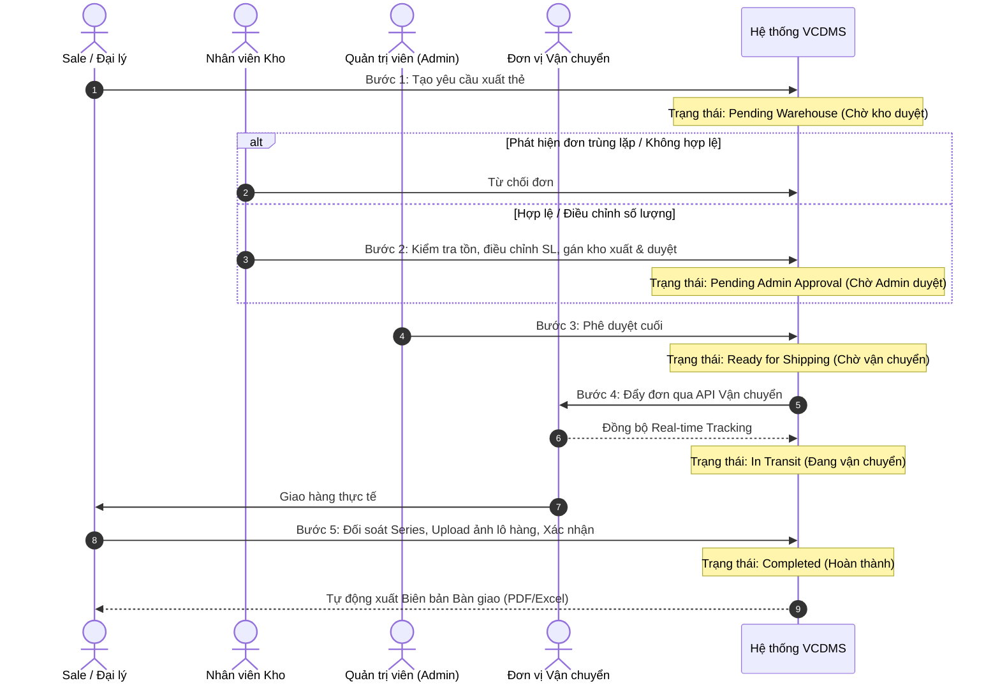

# 📖 TÀI LIỆU MÔ TẢ YÊU CẦU PHẦN MỀM (SRS)
## HỆ THỐNG QUẢN LÝ XUẤT NHẬP KHO & PHÂN PHỐI THẺ VETC

---

## 📑 Mục lục (Table of Contents)
- [I. Tổng quan Hệ thống & Phân quyền (RBAC)](#i-tổng-quan-hệ-thống--phân-quyền-rbac)
- [II. Quy trình Nghiệp vụ Xuất thẻ (Workflow)](#ii-quy-trình-nghiệp-vụ-xuất-thẻ-workflow)
  - [1. Sơ đồ quy trình nghiệp vụ](#1-sơ-đồ-quy-trình-nghiệp-vụ)
  - [2. Chi tiết các bước thực hiện](#2-chi-tiết-các-bước-thực-hiện)
- [III. Yêu cầu Chức năng Chi tiết (Functional Requirements)](#iii-yêu-cầu-chức-năng-chi-tiết)
  - [1. Quản lý Yêu cầu Xuất / Nhập Kho](#1-quản-lý-yêu-cầu-xuất--nhập-kho)
  - [2. Theo Dõi Vận Chuyển (Tracking)](#2-theo-dõi-vận-chuyển-tracking)
  - [3. Nhận Hàng & Đối Soát (Proof of Delivery - POD)](#3-nhận-hàng--đối-soát-proof-of-delivery---pod)
  - [4. Quản Lý Thất Thoát & Truy Vết Thẻ (Audit & Loss Management)](#4-quản-lý-thất-thoát--truy-vết-thẻ-audit--loss-management)
  - [5. Danh Mục Quản Lý Kho](#5-danh-mục-quản-lý-kho)
  - [6. Tìm Kiếm & Lọc Nâng Cao](#6-tìm-kiếm--lọc-nâng-cao)
- [IV. Yêu cầu Phi chức năng (Non-Functional Requirements)](#iv-yêu-cầu-phi-chức-năng)
  - [1. Bảo mật dữ liệu (Security)](#1-bảo-mật-dữ-liệu-security)
  - [2. Hiệu năng & Rủi ro (Performance & Reliability)](#2-hiệu-năng--rủi-ro-performance--reliability)
- [V. Tài liệu Tham khảo (References)](#v-tài-liệu-tham-khảo-references)

---

## I. TỔNG QUAN HỆ THỐNG & PHÂN QUYỀN (RBAC)

Hệ thống được thiết kế với cơ chế phân quyền dựa trên vai trò (**Role-Based Access Control - RBAC**) dành cho 3 nhóm người dùng chính:

| Vai trò (Role) | Mô tả trách nhiệm chính |
| :--- | :--- |
| **Admin** (Quản trị viên) | Phê duyệt cuối cùng các đơn xuất kho, quản lý danh mục (kho, nhân sự), giám sát toàn bộ luồng dữ liệu và xem báo cáo tổng hợp. |
| **Nhân viên kho** (NV Kho) | Tiếp nhận yêu cầu, kiểm tra tồn kho, điều chỉnh số lượng xuất (nếu cần), chọn kho xuất hàng, quản lý thất thoát và cập nhật danh mục kho. |
| **Nhân viên Sale / Đại lý** | Tạo yêu cầu xuất thẻ, theo dõi trạng thái đơn hàng, xác nhận nhận hàng (kèm hình ảnh chứng minh) và tra cứu thẻ. |

---

## II. QUY TRÌNH NGHIỆP VỤ XUẤT THẺ (WORKFLOW)

Quy trình xử lý một yêu cầu xuất thẻ VETC từ lúc khởi tạo đến khi hoàn tất được thực hiện qua luồng phê duyệt 2 cấp nghiêm ngặt.

### 1. Sơ đồ quy trình nghiệp vụ

### 2. Chi tiết các bước thực hiện

* **Bước 1: Tạo yêu cầu** *(Thực hiện bởi: Sale / Đại lý)*
  * Sale/Đại lý lập đơn yêu cầu xuất thẻ trên hệ thống (chọn loại thẻ, số lượng).
  * **Trạng thái đơn ban đầu**: `Chờ kho duyệt (Pending Warehouse)`.

* **Bước 2: Soát xét & Điều chỉnh** *(Thực hiện bởi: Nhân viên Kho)*
  * NV Kho kiểm tra chi tiết đơn hàng:
    * **Từ chối**: Nếu phát hiện yêu cầu bị trùng lặp (Sale bấm gửi 2 lần).
    * **Điều chỉnh số lượng**: Thay đổi số lượng thẻ xuất nếu yêu cầu không hợp lý hoặc kho không đủ tồn (kèm ghi chú lý do).
    * **Gán kho**: Chọn kho xuất từ Danh mục kho.
    * **Chuyển tiếp**: Duyệt đơn để chuyển sang bước phê duyệt tiếp theo.
  * **Trạng thái đơn**: `Chờ Admin duyệt (Pending Admin Approval)`.

* **Bước 3: Phê duyệt cuối** *(Thực hiện bởi: Admin)*
  * Admin kiểm tra và ra quyết định duyệt cuối cùng.
  * **Trạng thái đơn**: `Chờ vận chuyển (Ready for Shipping)`.

* **Bước 4: Vận chuyển & Cập nhật** *(Hệ thống / Đơn vị Vận chuyển)*
  * Đơn hàng được đẩy tự động sang đơn vị vận chuyển đối tác qua API.
  * Hệ thống cập nhật vị trí/trạng thái theo thời gian thực (Real-time tracking).
  * **Trạng thái đơn**: `Đang vận chuyển (In Transit)`.

* **Bước 5: Nghiệm thu & Báo cáo** *(Thực hiện bởi: Sale / Đại lý)*
  * Khi nhận hàng, Sale/Đại lý chụp ảnh đối soát thực tế tải lên hệ thống.
  * Xác nhận đúng số lượng và dải số Series thẻ do kho cấp.
  * Nhấn nút **[Hoàn thành đơn hàng]**. Hệ thống tự động xuất báo cáo chi tiết.
  * **Trạng thái đơn**: `Hoàn thành (Completed)`.

---

## III. YÊU CẦU CHỨC NĂNG CHI TIẾT

### 1. Quản lý Yêu cầu Xuất / Nhập Kho
* **Khởi tạo đơn:** Cho phép Sale/Đại lý chọn loại thẻ, số lượng cần nhập.
* **Xử lý trùng lặp:** Hệ thống cảnh báo hoặc cho phép NV kho từ chối nhanh các đơn trùng lặp gửi trong thời gian ngắn.
* **Chỉnh sửa số lượng xuất:** NV Kho có quyền sửa *Số lượng duyệt* khác *Số lượng yêu cầu* (bắt buộc nhập lý do ghi chú).
* **Luồng phê duyệt 2 cấp:** Bắt buộc tuân thủ quy trình: `Kho duyệt` $\rightarrow$ `Admin duyệt`.

### 2. Theo Dõi Vận Chuyển (Tracking)
* **Tích hợp API:** Kết nối API với đơn vị vận chuyển đối tác đã ký hợp đồng để tự động đồng bộ dữ liệu.
* **Hiển thị thông tin:** Cung cấp đầy đủ trạng thái đơn hàng (Đã lấy hàng, Đang vận chuyển, Đến bưu cục, Đang giao...), vị trí hiện tại, mã vận đơn, tên đơn vị giao hàng.

### 3. Nhận Hàng & Đối Soát (Proof of Delivery - POD)
* **Upload hình ảnh:** Bắt buộc Sale/Đại lý đính kèm tối thiểu 01 ảnh chụp lô thẻ thực tế khi nhận hàng.
* **Check-list Series:** Hiển thị chi tiết dải số Series thẻ (*Series bắt đầu - Series kết thúc*) do kho cấp để Sale kiểm tra đối soát.
* **Xuất báo cáo:** Tự động tạo file *Biên bản Bàn giao Thẻ* (định dạng PDF/Excel) ngay khi nhấn nút **[Hoàn thành]**.

### 4. Quản Lý Thất Thoát & Truy Vết Thẻ (Audit & Loss Management)
* **Truy xuất nguồn gốc (Traceability):** Cho phép kiểm tra bất kỳ mã thẻ nào để tra cứu đầy đủ thông tin:
  * Xuất từ kho nào.
  * Nhân viên kho phụ trách xuất hàng.
  * Sale / Đại lý tiếp nhận.
  * Ngày giờ xuất kho và ngày giờ nhận hàng thực tế.
* **Xử lý đền bù thẻ mất:**
  * Ghi nhận thẻ báo mất/hỏng trong hệ thống.
  * Tích hợp chức năng nộp tiền đền bù / bù tiền thẻ (ghi nhận số tiền, mã giao dịch, hóa đơn đền bù đính kèm).
  * Tự động cập nhật trạng thái thẻ thành `Báo mất - Đã đền bù`.

### 5. Danh Mục Quản Lý Kho
* **Quản lý thông tin kho:** Tạo mới, chỉnh sửa, xóa hoặc ẩn các danh mục kho.
* **Dữ liệu chi tiết:** Mỗi kho lưu trữ đầy đủ: *Tên kho*, *Địa chỉ*, *Tên nhân viên kho phụ trách gửi hàng*, *Số điện thoại liên hệ*.
* **Cập nhật linh hoạt:** Toàn bộ thông tin trong danh mục kho có thể được cấu hình và thay đổi linh hoạt bởi Admin hoặc NV Kho có thẩm quyền.

### 6. Tìm Kiếm & Lọc Nâng Cao
* **Tìm kiếm nhanh (Global Search):** Cho phép tra cứu nhanh theo Mã thẻ / Dải Series thẻ và Tên nhân viên (Sale, Kho, Admin).
* **Bộ lọc nâng cao (Filter):** Hỗ trợ lọc đa điều kiện:
  * Khoảng thời gian (Ngày xuất / Ngày nhận).
  * Trạng thái đơn hàng.
  * Kho xuất hàng.
  * Đại lý tiếp nhận.

---

## IV. YÊU CẦU PHI CHỨC NĂNG (NON-FUNCTIONAL REQUIREMENTS)

### 1. Bảo mật dữ liệu (Security)
* **Xác thực & Phân quyền:** Sử dụng cơ chế JWT (JSON Web Token) hoặc OAuth 2.0. Phân quyền chặt chẽ theo vai trò (RBAC).
* **Mã hóa:** Mã hóa toàn bộ dữ liệu nhạy cảm và bắt buộc truyền tải dữ liệu qua giao thức an toàn HTTPS (SSL/TLS).
* **Nhật ký hệ thống (Audit Log):** Ghi nhận toàn bộ lịch sử tác động dữ liệu (Ai tạo, ai sửa số lượng, ai duyệt, thời gian cụ thể theo timestamp) nhằm phục vụ công tác tra soát và kiểm toán.

### 2. Hiệu năng & Rủi ro (Performance & Reliability)
* **Kiểm soát tính hợp lệ (Error Handling):** Hệ thống validate chặt chẽ dữ liệu đầu vào (chặn nhập số lượng âm, chặn chọn dải series bị trùng lặp).
* **Tốc độ phản hồi (Response Time):** Thời gian phản hồi cho các thao tác tra cứu / tìm kiếm mã thẻ $\le$ 2 giây.
* **Sao lưu dữ liệu (Backup & Recovery):** Tự động sao lưu dữ liệu hàng ngày (Daily Backup) để phòng ngừa rủi ro thất thoát dữ liệu thẻ.

---

## V. TÀI LIỆU THAM KHẢO (REFERENCES)

1. Tài liệu gốc: [`Tai_Lieu_Mo_Ta_Yeu_Cau_Phan_Mem_VETC.docx`](/docs/999-Resources/Tai_Lieu_Mo_Ta_Yeu_Cau_Phan_Mem_VETC.docx)
2. SRS Template chuẩn: [`Template-SRS.md`](/docs/999-Resources/Templates/Template-SRS.md)
3. Thuật ngữ & Từ điển hệ thống: [`Glossary.md`](/docs/999-Resources/Glossary.md)

---
*Tài liệu được chuẩn hóa và quản lý bởi TNMCORE-OS.*
